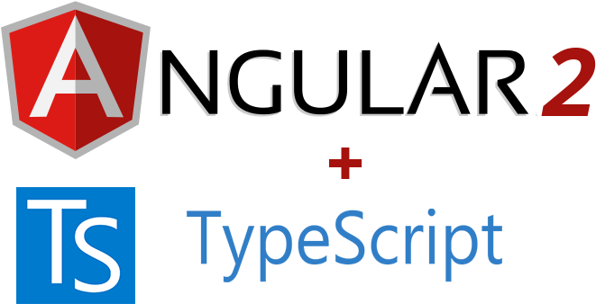

# Angular - Pokemons

_July 2021_

> 🔨 From Udemy '[Angular 9 : Développer votre première application (2021) - Simon DIENY](https://www.udemy.com/course/angular-developper-tutoriel-application-typescript/)'.



## Notes

### Manage var in template

#### keyup

**Case 1**

_app.component.ts_

```ts
  public value: string = "";
  // ...
  onKey(event: KeyboardEvent) {
    this.value = "Hello" + (event.target as HTMLInputElement).value;
  }
```

_app.component.html_

```html
<input (keyup)="onKey($event)" />
<p>{{ value }}</p>
```

**Case 2**

_app.component.html_

```html
<input #box (keyup)="0" />
<p>{{ box.value }}</p>
```

**Case 3**

_app.component.ts_

```ts
  public value: string = "";
  // ...
  onKey(value: string) {
    this.value = "Hello" + value;
  }
```

_app.component.html_

```html
<input #box (keyup)="onKey(box.value)" />
<p>{{ box.value }}</p>
<p>{{ value }}</p>
```

#### keyup.enter / blur

_app.component.ts_

```ts
values = "";
```

_app.component.html_

```html
<input #box (keyup.enter)="values=box.value" (blur)="values=box.value" />
<p>{{ values }}</p>
```

#### Directive ngIf

_app.component.ts_

```ts
age = 20;
```

_app.component.html_

```html
<p *ngIf="age > 18">Message for people upper 18</p>
```

#### Directive ngFor

_app.component.ts_

```ts
import { Component, OnInit } from "@angular/core";

import { Pokemon } from "./pokemon";
import { POKEMONS } from "./mock-pokemons";

@Component({
  selector: "app-root",
  templateUrl: "./app.component.html",
  styleUrls: ["./app.component.css"]
})
export class AppComponent implements OnInit {
  public pokemons: Pokemon[];
  public title: string = "Pokemon list";
  age = 20;

  ngOnInit() {
    this.pokemons = POKEMONS;
  }
}
```

_app.component.html_

```html
<ul>
  <li *ngFor="let pokemon of pokemons">{{ pokemon.name }}</li>
</ul>
```

## Ressources

- [Ressources de la formation](https://www.alexandria-library.co/ressources-angular/)
